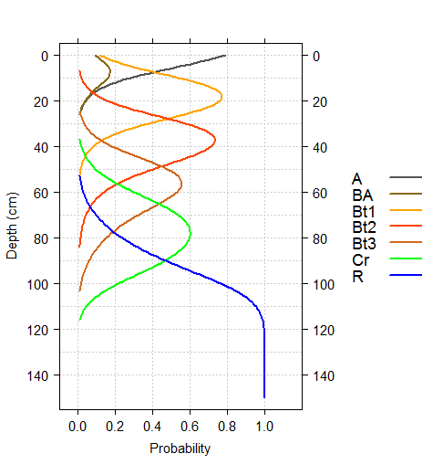

```{r setup, echo=FALSE, results='hide'}
library(knitr)
opts_chunk$set(message=FALSE, warning=FALSE, dpi=120, fig.align='center', dev='CairoPNG', dev.args=list(pointsize=10), tidy=FALSE)
options(width=100, stringsAsFactors=FALSE)

knit_hooks$set(htmlcap = function(before, options, envir) {
  if(!before) {
    paste('<p class="caption" style="font-size:85%; font-style: italic; font-weight: bold;">',options$htmlcap,"</p><hr>",sep="")
    }
    })
```


Estimation of Most-Likely Horizon Depths
===============================
D.E. Beaudette, J.M. Skovlin
<br>
`r format(Sys.time(), "%Y-%m-%d")`
<br>
This document is based on `aqp` version `r utils::packageDescription("aqp", field="Version")` and `soilDB` version `r utils::packageDescription("soilDB", field="Version")`.


# Introduction

## Review
Consider this situation: you have a collection of pedons that have been correlated to a named soil series (or component) and would like to *objectively* compute a range in characteristics ("low-rv-high" values) and horizon depths. As with most collections of pedon data, there may be considerable variation in description style and horizons used, horizon depths, and number of horizons described:


In this scenario, there are several obvious &ldquo;micro-correlation&rdquo; decisions that need to be made before horizons can be grouped for aggregation. For example, what horizonation prototype scheme (e.g., A-Bt1-Bt2-Bt3-Cr-R) best conveys the concept of this soil series or soil component? Does it make sense to group [Bt3, Bt4, BCt, CBt] horizons for aggregation? Or what about grouping [Bt3, 2Bt3] horizons? Do [BA, AB] horizons occur frequently enough to be included in the horizonation prototype?

Based on your knowledge of the area, pedon 2 might be a good "typical" pedon to use in developing a horizonation prototype. After careful review of the data and consultation with your crew, a new set of labels are assigned to each horizon (<span style="color: red;">red labels in figure above</span>) that define groups over which soil properties will be aggregated. These new labels define *functionally similar* groups that may span multiple genetic horizons. Once you have assigned [generalized horizon labels](https://r-forge.r-project.org/scm/viewvc.php/*checkout*/docs/aqp/gen-hz-assignment.html?root=aqp) to your pedons it is possible to generate a set of "most-likely" horizon depths.


## Probabalistic Representation of Horizon Depths


  


# Setup R Envionment
If you have never used the [aqp](https://r-forge.r-project.org/scm/viewvc.php/*checkout*/docs/aqp/aqp-intro.html?root=aqp) or [soildb](https://r-forge.r-project.org/scm/viewvc.php/*checkout*/docs/soilDB/soilDB-Intro.html?root=aqp) packages before, you will likely need to install them. This only needs to be done once. 
```{r install-packages, eval=FALSE}
# stable version from CRAN + dependencies
install.packages('aqp', dep=TRUE) 
install.packages('soilDB', dep=TRUE)
# latest versions from R-Forge:
install.packages('aqp', repos="http://R-Forge.R-project.org")
install.packages('soilDB', repos="http://R-Forge.R-project.org")
```

Once you have all of the R packages on which  this document depends, it is a good idea to load them. R packages must be **installed** anytime you change versions of R (e.g., after an upgrade) and **loaded** anytime you want to access functions from within those packages.

```{r load-packages}
library(aqp)
library(soilDB)
library(latticeExtra)
library(plyr)
```

# Sample Data
While the methods outlined in this document can be applied to any collection of pedons, it is convenient to work with a standardized set of data. You can follow along with the analysis by copying code from the following blocks and running it in your **R** session. The sample data used in this document is based on 15 soil profiles that have been correlated to the [Loafercreek](https://soilseries.sc.egov.usda.gov/OSD_Docs/L/LOAFERCREEK.html) soil series from the Sierra Nevada Foothill Region of California. Note that the internal structure of the `loafercreek` data is identical to the structure returned by [`fetchNASIS()` from the soilDB package](https://r-forge.r-project.org/scm/viewvc.php/*checkout*/docs/soilDB/soilDB-Intro.html?root=aqp). All horizon-level values are pulled from the pedon horizon table of the pedons being analyzed.

```{r load-data, fig.width=12, fig.height=5, htmlcap='15 pedons correlated to the Loafercreek soil series.'}
# load sample data from the soilDB package
data(loafercreek, package = 'soilDB')
# keep only the first 15 pedons
pedons <- loafercreek[1:15, ]
# plot profile sketches
par(mar=c(0,0,0,0))
plot(pedons, name='hzname', print.id=FALSE, cex.names=0.8, axis.line.offset=-4)
```


## Optional: Follow Along with Your Data
The following code block demonstrates how to pull data in using the [`fetchNASIS()` function from the soilDB package](https://r-forge.r-project.org/scm/viewvc.php/*checkout*/docs/soilDB/soilDB-Intro.html?root=aqp).

```{r use-nasis-data, eval=FALSE}
# first load the desired data set within NASIS into your NASIS selected set
# then load data from the NASIS selected set into R
pedons <- fetchNASIS()
# optionally subset the data by taxon name - enter your taxon name
pedons <- pedons[grep(pattern='ENTER_YOUR_TAXON_NAME', pedons$taxonname, ignore.case=TRUE), ]
```

# Methods


