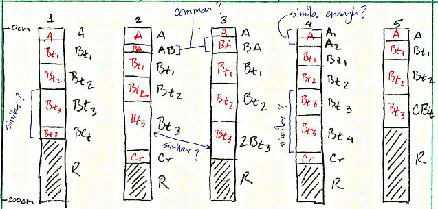

```{r setup, echo=FALSE, results='hide'}
library(knitr)
opts_chunk$set(message=FALSE, warning=FALSE, dpi=120, fig.align='center', dev='CairoPNG', dev.args=list(pointsize=10), tidy=FALSE)
options(width=100, stringsAsFactors=FALSE)

knit_hooks$set(htmlcap = function(before, options, envir) {
  if(!before) {
    paste('<p class="caption" style="font-size:85%; font-style: italic; font-weight: bold;">',options$htmlcap,"</p><hr>",sep="")
    }
    })
```


Assigning Generalized Horizon Labels
===============================
D.E. Beaudette, J.M. Skovlin [`r format(Sys.time(), "%Y-%m-%d")`]

# Introduction

## An Example
Consider the situation: you have a collection of pedons that have been correlated to a named soil series (or component) and would like to *objectively* compute a range in characteristics ("low-rv-high" values) and horizon depths. As with most collections of pedon data there may be considerable variation in description style and horizons used, horizon depths, and number of horizons described:



In this contrived example, there are several obvious "micro-correlation" decisions that need to be made before horizons can be grouped for aggregation. For example, what horizonation prototype scheme will be used (e.g. A-Bt1-Bt2-Bt3-Cr-R) and best conveys the concept of this soil series or soil component? Does it make sense to group {Bt3, Bt4, BCt, CBt} horizons for aggregation? Along those lines, what about grouping {Bt3, 2Bt3} horizons? Do {BA, AB} horizons occur frequently enough to be included in the horizonation prototype?

Based on your knowledge of the area pedon 2 might be a good "typical" pedon from which a horizonation prototype can be developed. After careful review of the data and consultation with your crew, a new set of labels are assigned to each horizon (<span style="color: red;">red labels in figure above</span>) that define groups over which soil properties will be aggregated. These new labels define *functionally-similar* groups that may span multiple genetic horizons.


## Formalized Approach 
This document describes an aggregation strategy based on the use of "generalized horizon labels" (GHL) through a combination of narrative, **R** code, and figures. You can follow along in an **R** session by copying code from the grey boxes and pasting it into the **R** console.

Here is a basic outline of the process:

  1. Select a set of GHL that best represent a group of pedons to be aggregated. This could be based on series descriptions, expert-knowledge, or even inspection of the most frequently occurring horizon designations.
  
  2. Assign GHL to each horizon using whatever information that is available for grouping horizons. This micro-correlation of horizon designations will likely require slightly different "rules" in each instance. Careful inspection of horizon designation and observed properties is critical.
  
  3. Evaluate GHL assignments and manually refine as needed. 
  
  4. Keep track of final GHL assignments in NASIS or text file. 
  
  5. Compute range in characteristics, aka [low-rv-high values](http://casoilresource.lawr.ucdavis.edu/wiki/Low-rv-high), (e.g. clay, sand, pH, etc.) over GHL. (next document in this series)
  
  6. Estimate a most-likely horizonation (e.g. top and bottom depths) for each generalized horizon label. (next document in this series)


# Setup R Envionment
If you have never used the [aqp](https://r-forge.r-project.org/scm/viewvc.php/*checkout*/docs/aqp/aqp-intro.html?root=aqp) or [soildb](https://r-forge.r-project.org/scm/viewvc.php/*checkout*/docs/soilDB/soilDB-Intro.html?root=aqp) packages before, you will likely need to install them. This only needs to be done once. 
```{r install-packages, eval=FALSE}
# stable version from CRAN + dependencies
install.packages('ape', dep=TRUE) 
install.packages('latticeExtra', dep=TRUE)
install.packages('plyr', dep=TRUE) 
install.packages('aqp', dep=TRUE) 
install.packages('soilDB', dep=TRUE)
# latest versions from R-Forge:
install.packages('aqp', repos="http://R-Forge.R-project.org", type='source')
install.packages('soilDB', repos="http://R-Forge.R-project.org", type='source')
```

Now that you have all of the R packages that this document depends on, it would be a good idea to load them. R packages must be **installed** anytime you change versions of R (e.g. after an upgrade), and **loaded** anytime you want to access functions from within those packages.

```{r load-packages}
library(aqp)
library(soilDB)
library(ape)
library(latticeExtra)
library(plyr)
library(lattice)
library(cluster)
library(MASS)
```

# Sample Data
While the methods outlined in this document can be applied to any collection of pedons, it is convenient to work with a standardized set of data. You can follow along with the analysis by copying code from the following blocks and running it in your **R** session. The sample data used in this document is based on 15 soil profiles that have been correlated to the [Loafercreek](https://soilseries.sc.egov.usda.gov/OSD_Docs/L/LOAFERCREEK.html) soil series from the Sierra Nevada Foothill Region of California. Note that the internal structure of the `loafercreek` data is identical to the structure returned by [`fetchNASIS()` from the soilDB package](https://r-forge.r-project.org/scm/viewvc.php/*checkout*/docs/soilDB/soilDB-Intro.html?root=aqp).

```{r load-data, fig.width=12, fig.height=5, htmlcap='15 pedons correlated to the Loafercreek soil series.'}
# load sample data from the soilDB package
data(loafercreek, package = 'soilDB')
# keep only the first 15 pedons
loafercreek <- loafercreek[1:15, ]
# plot profile sketches
par(mar=c(0,0,0,0))
plot(loafercreek, name='hzname', print.id=FALSE, cex.names=0.8, axis.line.offset=-4)
```


# Methods

## Selection of Generalized Horizon Labels

Generalized horizon labels represent an expert-guided selection of designations that were consistently observed in the field, and meaningful in terms of soil morphology and management. The very first step in this process is to tabulate the number of times each horizon designation occurs.

```{r tabulate-horizonation}
sort(table(loafercreek$hzname), decreasing=TRUE)
```

In this case [`r names(sort(table(loafercreek$hzname), decreasing=TRUE))[1:4]`] horizon designations appear to be a good starting point. However, relying on field experience and expert knowledge of these soils, cross-checking against the [OSD](https://soilseries.sc.egov.usda.gov/OSD_Docs/L/LOAFERCREEK.html) and talking with other soil scientists may be more important than the previous tabulation. 

A quick summary of horizon depth mid-points (e.g. average depth of horizon) can help organize the various designations and possibly give some clues as to how they can be grouped. The following plot is called a [box and whisker plot](http://en.wikipedia.org/wiki/Box_plot).


```{r horizonation-mid-point, fig.width=10, fig.height=4, htmlcap='Range in horizon depth mid-point for original horizon designations.'}
# compute horizon mid-points
loafercreek$mid <- with(horizons(loafercreek), (hzdept + hzdepb) / 2)

# sort horizon designation by group-wise median values
hz.designation.by.median.depths <- names(sort(tapply(loafercreek$mid, loafercreek$hzname, median)))

# plot the distribution of horizon mid-points by designation
bwplot(mid ~ factor(hzname, levels=hz.designation.by.median.depths), 
       data=horizons(loafercreek), 
       ylim=c(155, -5), ylab='Horizon Mid-Point Depth (cm)', 
       scales=list(y=list(tick.number=10)), 
       panel=function(...) {
  panel.abline(h=seq(0, 140, by=10), v=1:length(hz.designation.by.median.depths), col=grey(0.8), lty=3)
	panel.bwplot(...)
})
```

Next, a similar summary of soil properties (clay content and total rock fragment volume) is presented. The idea here is to determine which horizons designations can be grouped and which generalized horizon labels will be assigned to each group.

```{r univariate-eval-clay, fig.width=10, fig.height=4, htmlcap='Range in clay content for original horizon designations.'}
# box and wisker plot by clay content
bwplot(clay ~ factor(hzname, levels=hz.designation.by.median.depths), 
       data=horizons(loafercreek), 
       ylab='Clay Content (%)', 
       scales=list(y=list(tick.number=10)), 
       panel=function(...) {
  panel.abline(h=seq(0, 100, by=5), v=1:length(hz.designation.by.median.depths), col=grey(0.8), lty=3)
  panel.bwplot(...)
})
```

```{r univariate-eval-rf, fig.width=10, fig.height=4, htmlcap='Range in total rock fragment content for original horizon designations.'}
# box and wisker plot by total rock fragment volume
bwplot(total_frags_pct ~ factor(hzname, levels=hz.designation.by.median.depths), 
       data=horizons(loafercreek), 
       ylab='Total Rock Fragment Volume (%)', 
       scales=list(y=list(tick.number=10)), 
       panel=function(...) {
  panel.abline(h=seq(0, 100, by=10), v=1:length(hz.designation.by.median.depths), col=grey(0.8), lty=3)
  panel.bwplot(...)
})
```


Sometimes looking at thematic soil profile sketches can be informative.
```{r thematic-profile-sketch, fig.width=12, fig.height=5, htmlcap='Horizon colors are based on clay content.'}
# color horizons by clay content
par(mar=c(0,0,3,3))
plot(loafercreek, name='hzname', print.id=FALSE, cex.names=0.8, axis.line.offset=-4, color='clay')
```

## Assignment of Generalized Horizon Labels

Once a set of generalized horizon labels have been determined a corresponding set of [regular expression](http://en.wikipedia.org/wiki/Regular_expression) (REGEX) rules were developed to convert field-described designations into GHL. Pattern matching with REGEX will typically assign useful GHL, however, there will always be cases where manual intervention is required. More on that later.

From the above analysis and the [OSD](https://soilseries.sc.egov.usda.gov/OSD_Docs/L/LOAFERCREEK.html), it seems like the following sequence of GHL are appropriate: (`r c('A','Bt1','Bt2','Bt3','Cr','R')`)-- an A horizon, followed by 3 Bt horizons, then Cr and finally R. For each GHL we need a corresponding REGEX rule. For example, `'^A$|Ad|Ap'` will match 'A', 'Ad', and 'Ap'.

```{r generalize-hz-names-1}
# save our GHL
n <- c('A','Bt1','Bt2','Bt3','Cr','R')
# REGEX rules
p <- c('^A$|Ad|Ap',
       'Bt1$',
       '^Bt2$',
       '^Bt3|^Bt4|CBt$|BCt$|2Bt|2CB$|^C$',
       'Cr',
       'R')
```


Apply GHL pattern-matching rules and save to a new column called `genhz` and cross-tabulate the occurrence of GHL and original designations.
```{r generalize-hz-names-2}
loafercreek$genhz <- generalize.hz(loafercreek$hzname, n, p)
# cross-tabulate original horizon designations and GHL
addmargins(table(loafercreek$genhz, loafercreek$hzname))
```

From the above cross-tabulation, we can see that a couple of original designations were not matched (`not-used` in the table) by our REGEX rules: BA, Bw, and Oi horizons. In this example, we are going to make the assumption that those horizons aren't common enough for inclusion in our set of GHL.

## Evaluation of Generalized Horizon Labels

An initial evaluation of our GHL assignment can be accomplished by plotting profile sketches with horizons colored by GHL. That looks about right, but further investigation may be warranted.
```{r plot-ghl-1, fig.width=12, fig.height=5, htmlcap='Horizon colors are based on assigned GHL.'}
# make a palette of colors, last color is for not-used class
cols <- c(grey(0.33), 'orange', 'orangered', 'chocolate', 'green', 'blue', 'yellow')
# assign a color to each generalized horizon label
hz.names <- levels(loafercreek$genhz)
loafercreek$genhz.soil_color <- cols[match(loafercreek$genhz, hz.names)]
# plot generalized horizons via color and add a legend
par(mar=c(4,0,0,0))
plot(loafercreek, name='hzname', print.id=FALSE, cex.names=0.8, axis.line.offset=-4, color='genhz.soil_color')
legend('bottomleft', legend=hz.names, pt.bg=c(cols), pch=22, bty='n', cex=2)
```


A box and whisker plot of the depth-ranges for each of the generalized horizon labels helps to visualize the degree of overlap. [Slicing](https://r-forge.r-project.org/scm/viewvc.php/*checkout*/docs/aqp/aqp-intro.html?root=aqp) the collection of profiles along 1-cm intervals generates a more precise figure.
```{r plot-ghl-2, fig.width=6, fig.height=5, htmlcap='Range in GHL horizon depth.'}
# slice profile collection from 0-150 cm
s <- slice(loafercreek, 0:150 ~ genhz)
# convert horizon name back to factor, using original levels
s$genhz <- factor(s$genhz, levels = hz.names)
# plot depth-ranges of generalized horizon slices
bwplot(hzdept ~ genhz, data=horizons(s), 
       ylim=c(155, -5), ylab='Generalized Horizon Depth (cm)', 
       scales=list(y=list(tick.number=10)), asp=1, 
       panel=function(...) {
          panel.abline(h=seq(0, 140, by=10), v=1:length(hz.names),col=grey(0.8), lty=3)
	        panel.bwplot(...)
          }
       )
```


### Advanced: Multivariate Soil Property Summary

The evaluation of generalized horizon labels typically requires a review of more information than field-described horizon labels and depth. For example, clay content, sand content, pH, total rock fragment volume, and horizon mid-points are soil properties that can be used to differentiate horizons-- as long as the data are populated. In this document clay content, total rock fragment volume and horizon mid-points are used. Multivariate comparisons are commonly based on the concept of [pair-wise dissimilarity](http://hymenoptera.tamu.edu/courses/ento601/pdf/Sokal_1966.pdf), and subsequent reduction of the resulting [distance matrix](http://en.wikipedia.org/wiki/Distance_matrix) into a simpler representation. [Non-metric multidimensional scaling](http://en.wikipedia.org/wiki/Multidimensional_scaling)(nMDS) is one method for reducing the distance matrix into a new set of coordinates in two-dimensional space. A [related](https://r-forge.r-project.org/scm/viewvc.php/*checkout*/docs/aqp/aqp-profile-dissimilarity.html?root=aqp) document explores this idea further.

```{r evaluate-genhz-assignment}
# store the column names of our variables of interest
vars <- c('clay', 'mid', 'total_frags_pct')
# result is a list of several items
hz.eval <- evalGenHZ(loafercreek, 'genhz', vars)
# extract MDS coords
loafercreek$mds.1 <- hz.eval$horizons$mds.1
loafercreek$mds.2 <- hz.eval$horizons$mds.2
# extract silhouette widths and neighbor
loafercreek$sil.width <- hz.eval$horizons$sil.width
loafercreek$neighbor <- hz.eval$horizons$neighbor
```


In the following figure generalized horizon labels are plotted at nMDS coordinates as colored circles, along with original horizon designations and pedon IDs. Ideally, groupings of GHL should form relatively homogeneous clusters in this figure, however, there will always be some overlap at the edges. Heterogeneous regions should probably be inspected for cases where the assigned GHL may not make sense. In this case, the original designation of "Bt2" for pedon ID 09CKS036 doesn't seem to fit into the 'Bt2' generalized horizon. According to the soil properties used (clay content, total rock fragments, horizon mid-point) it may fit better into the 'Bt1' generalized horizon. Decisions like this can only be made within the context of field experience or at least some level of expert knowledge about the soils in question.
```{r mds-plot, fig.width=10, fig.height=10, htmlcap='Horizon designations and GHL as plotted along nMDS axes.'}
# convert loafercreek to a data.frame
loafercreek.df <- as(loafercreek, 'data.frame')
# plot generalized horizon labels at MDS coordinates
mdsplot <- xyplot(mds.2 ~ mds.1, groups=genhz, data=loafercreek.df, 
                  xlab='', ylab='', aspect=1,
                  scales=list(draw=FALSE), 
                  auto.key=list(columns=length(levels(loafercreek.df$genhz))), 
                  par.settings=list(
                    superpose.symbol=list(pch=16, cex=3, alpha=0.5)
                  )
)

# annotate with original hzname and pedon ID
mdsplot +
  layer(panel.abline(h=0, v=0, col='grey', lty=3)) + 
  layer(panel.text(loafercreek.df$mds.1, loafercreek.df$mds.2, loafercreek.df$hzname, cex=0.85, font=2, pos=3)) +
  layer(panel.text(loafercreek.df$mds.1, loafercreek.df$mds.2, loafercreek.df$pedon_id, cex=0.55, font=1, pos=1))
```


The [silhouette width](http://www.sciencedirect.com/science/article/pii/0377042787901257) metric is a useful indicator of how consistently group labels partition observations in a dissimilarity matrix. Silhouette widths closer to 1 indicate excellent partitioning, while values closer to 0 indicate less effective partitioning. Silhouette widths less than 0 are often associated with inappropriate label assignment. A sketch of profiles with horizons colored by silhouette width can shed some light on possible horizons with inappropriate GHL assignment or perhaps a pedon that doesn't fit within the concept of Loafercreek. For example, many of the horizons associated with pedon ID 09CKS036 don't appear to fit within the collection of soil properties associated with generalized horizon labels "Bt1", "Bt2", and "Bt3". Keep in mind that this evaluation is only based on three soil properties-- expert judgement will be required for a final assignment of GHL.
```{r silhouette-sketch, fig.width=12, fig.height=5, htmlcap='Blue and green colors warrant further investigation.'}
par(mar=c(0,0,3,3))
plot(loafercreek, name='hzname', label='pedon_id', cex.names=0.8, axis.line.offset=-4, color='sil.width')
```


The following table contains information on those horizons with silhouette widths less than 0. The "neighbor" column contains the next closest GHL (in terms of the soil properties used in the pair-wise dissimilarity calculation) which may be a more appropriate GHL candidate.
```{r silhouette-summary}
# index those horizons with silhouette widths less than 0
check.idx <- which(loafercreek.df$sil.width < 0)
# sort this index based on min sil.width
check.idx.sorted <- check.idx[order(loafercreek.df$sil.width[check.idx])]
# list those pedons/horizons that may need some further investigation
loafercreek.df[check.idx.sorted, c('peiid', 'pedon_id', 'hzname', 'genhz', 'neighbor', 'sil.width', vars)]
# print a table summarizing the mean and standard deviation (in parenthesis) of soil properites considered
hz.eval$stats
```

Plot profiles with only those horizons with silhouette widths less than 0 flagged.
```{r silhouette-sketch-flagged, fig.width=12, fig.height=5, htmlcap='Horizons with red colors warrant further investigation.'
# add a column containing a color (red) that flags horizons with silhouette width less than 0
loafercreek$sil.flag <- ifelse(loafercreek$sil.width < 0, 'red', 'white')
par(mar=c(0,0,3,3))
plot(loafercreek, name='hzname', label='pedon_id', cex.names=0.8, axis.line.offset=-4, color='sil.flag')
```

## Saving GHL to NASIS
GHL assignment as decried thus far applies only to ***in-memory*** objects in the current R session. In order to use these GHL in further analysis or perform manual adjustments, the GHL need to be saved externally. If you are a NASIS user (working with data derived from NASIS) then the following code will create a text file that can be read by NASIS and stored in the `dspcomplayerid` field of the "pedon horizon" table. The "Update horizon group aggregations" calculation ("Calculations" -> "Pedon Horizon" -> "Update horizon group aggregations") expects a text file at the `C:/data/horizon_agg.txt` location on your system, containing phiid and generalized horizon labels.  

Note that some people prefer to adjust GHL assignments in R while others prefer to make adjustments after loading the data into NASIS.
```{r save-to-nasis, eval=FALSE}
# clear-out any existing files
rules.file <- 'C:/data/horizon_agg.txt'
write.table(data.frame(), file=rules.file, row.names=FALSE, quote=FALSE, na='', col.names=FALSE, sep='|')
# extract horizon data
h <- horizons(loafercreek)
# strip-out 'not-used' genhz labels and retain horizon ID and genhz assignment
h <- h[which(h$genhz != 'not-used'), c('phiid', 'genhz')]
# append to NASIS import file
write.table(h, file=rules.file, row.names=FALSE, quote=FALSE, na='', col.names=FALSE, sep='|', append=TRUE)
```


# Concluding Remarks
In the next document we will work with pedon data from NASIS and use our GHL to generate estimates of "low-rv-high" style range in characteristics. An alternative approach to assignment of GHL can be performed with the "Update comp layer id by hzname (horizon group Aggregation)" calculation-- however, this calculation performs only basic pattern matching and the user has much less ability to guide and control the resulting GHL assignments than in the method outlined here.


