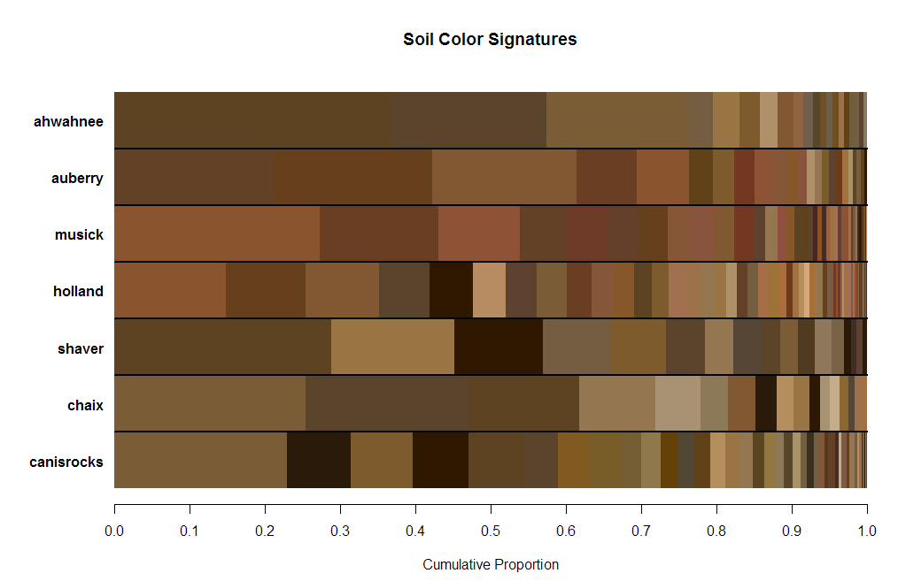
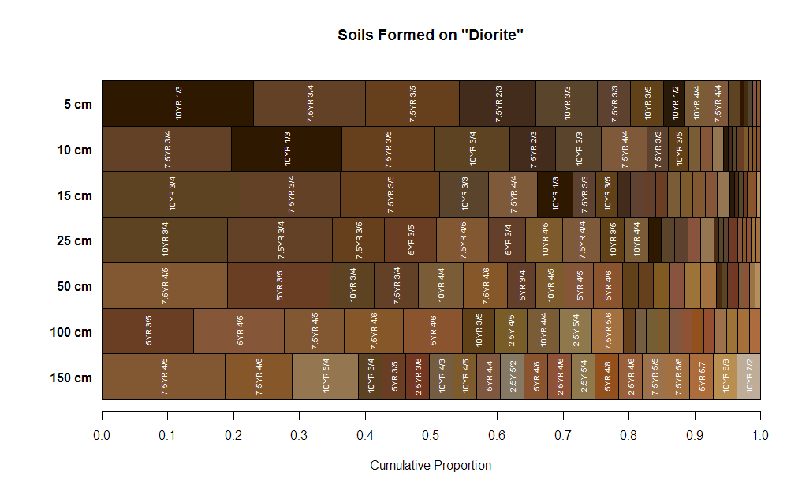

```{r setup, echo=FALSE, results='hide'}
# options for knitr
library(knitr, quietly = TRUE)
library(printr, quietly = TRUE)
opts_chunk$set(message=FALSE, warning=FALSE, background='#F7F7F7', dpi=100, fig.align='center', dev='png', dev.args=list(pointsize=10, type='cairo', antialias='subpixel'), tidy=TRUE)

knit_hooks$set(htmlcap = function(before, options, envir) {
  if(!before) {
    paste('<p class="caption" style="font-size:85%; font-style: italic; font-weight: bold;">',options$htmlcap,"</p><hr>",sep="")
    }
    })

# options for R session
options(width=100, stringsAsFactors=FALSE)
```


Some ideas on summarizing soil color
====================================
D.E. Beaudette
<br>
`r format(Sys.time(), "%Y-%m-%d")`
<br>
This document is based on `aqp` version `r utils::packageDescription("aqp", field="Version")` and `sharpshootR` version `r utils::packageDescription("sharpshootR", field="Version")`.


## Setup R Envionment
If you have never used the [aqp](https://r-forge.r-project.org/scm/viewvc.php/*checkout*/docs/aqp/aqp-intro.html?root=aqp) or sharpshootR packages before, you will likely need to install them. This only needs to be done once.
```{r install-packages, eval=FALSE}
# stable version from CRAN and all dependencies
install.packages('aqp', dep=TRUE) 
install.packages('soilDB', dep=TRUE)
install.packages('sharpshootR', dep=TRUE)
# latest versions from R-Forge:
install.packages('aqp', repos="http://R-Forge.R-project.org", type='source')
install.packages('soilDB', repos="http://R-Forge.R-project.org", type='source')
install.packages('sharpshootR', repos="http://R-Forge.R-project.org", type='source')
```


Now that you have all of the R packages that this document depends on, it would be a good idea to load them. R packages must be **installed** anytime you change versions of R (e.g. after an upgrade), and **loaded** anytime you want to access functions from within those packages.

```{r load-packages}
library(soilDB)
library(aqp)
library(sharpshootR)
```


## Sample Data
While the methods outlined in this document can be applied to any collection of pedons, it is convenient to work with a standardized set of data. You can follow along with the analysis by copying code from the following blocks and running it in your **R** session. The sample data used in this document is based on 30 soil profiles that have been correlated to the [Loafercreek](https://soilseries.sc.egov.usda.gov/OSD_Docs/L/LOAFERCREEK.html) soil series from the Sierra Nevada Foothill Region of California. Note that the internal structure of the `loafercreek` data is identical to the structure returned by [`fetchNASIS()` from the soilDB package](https://r-forge.r-project.org/scm/viewvc.php/*checkout*/docs/soilDB/soilDB-Intro.html?root=aqp). All horizon-level values are pulled from the pedon horizon table of the pedons being analyzed.

```{r load-data, fig.width=12, fig.height=5, htmlcap='Sample data, pedons correlated to the Loafercreek soil series. Original data were loaded from NASIS.'}
# load sample data from the soilDB package
data(loafercreek, package = 'soilDB')
# graphical check
par(mar=c(0,0,0,0))
plot(loafercreek, name='', print.id=FALSE, cex.names=0.8, axis.line.offset=-4, max.depth=100)
```


## Methods


```{r agg-color-data-0, fig.width=10, fig.height=6, htmlcap='An aggregate representation of soil color.', echo=FALSE}
# load some example data
data(sp1, package='aqp')

# upgrade to SoilProfileCollection and convert Munsell colors
sp1$soil_color <- with(sp1, munsell2rgb(hue, value, chroma))
depths(sp1) <- id ~ top + bottom
site(sp1) <- ~ group

# generalize horizon names
n <- c('O', 'A', 'B', 'C')
p <- c('O', 'A', 'B', 'C')
sp1$genhz <- generalize.hz(sp1$name, n, p)

par(mar=c(4.5,1.5,0,0))
aggregateColorPlot(aggregateColor(sp1, 'genhz'), label.cex = 1, print.n.hz = TRUE)
```


### Depth Slices
```{r agg-color-data-1, fig.width=10, fig.height=6, htmlcap=''}
# slice color data at select depths
s <- slice(loafercreek, c(5, 10, 15, 25, 50, 75) ~ soil_color, strict = FALSE)

# make horizon labels based on slice depth
s$slice <- paste0(s$hzdept, ' cm')
s$slice <- factor(s$slice, levels=guessGenHzLevels(s, 'slice')$levels)

par(mar=c(4.5,2.5,4.5,0))
aggregateColorPlot(aggregateColor(s, 'slice'), label.cex=0.65, main='Loafercreek Dry Colors\nDepth Slices', print.n.hz = TRUE)
```

### Generalized Horizon Labels
```{r agg-color-data-2, fig.width=10, fig.height=6, htmlcap=''}
# generalize horizon names using REGEX rules
n <- c('Oi', 'A', 'BA','Bt1','Bt2','Bt3','Cr','R')
p <- c('O', '^A$|Ad|Ap|AB','BA$|Bw', 'Bt1$|^B$','^Bt$|^Bt2$','^Bt3|^Bt4|CBt$|BCt$|2Bt|2CB$|^C$','Cr','R')
loafercreek$genhz <- generalize.hz(loafercreek$hzname, n, p)

# remove non-matching generalized horizon names
loafercreek$genhz[loafercreek$genhz == 'not-used'] <- NA
loafercreek$genhz <- factor(loafercreek$genhz)

aggregateColorPlot(aggregateColor(loafercreek, 'genhz'), main='Loafercreek Series Dry Colors\nGeneralized Horizon Labels', print.n.hz = TRUE, label.cex = 0.8)
```


### Site-Level Data
```{r agg-color-data-3, fig.width=10, fig.height=6, htmlcap=''}
par(mar=c(4.5,4,4.5,0))
aggregateColorPlot(aggregateColor(loafercreek, 'hillslope_pos'), main='Loafercreek Series Dry Colors\nHillslope Position')
par(mar=c(4.5,5,4.5,0))
aggregateColorPlot(aggregateColor(loafercreek, 'bedrock_kind'), main='Loafercreek Series Dry Colors\nBedrock Kind')
```


## Additional Examples

### Soil Color Signatures



```{r agg-color-additional-examples-1, eval=FALSE}
# get data from NASIS or similar source
f <- fetchNASIS(rmHzErrors = TRUE)

# an ordered set of series names
soils <- c('ahwahnee', 'auberry', 'musick', 'holland', 'shaver', 'chaix', 'canisrocks')

# extract these soils and normalize taxonname
f.sub <- f[grep(paste0(soils, collapse = '|'), f$taxonname, ignore.case = TRUE), ]
for(x in soils) {
  f.sub$taxonname[grep(x, f.sub$taxonname, ignore.case = TRUE)] <- x
}
# reset levels to order specified above
f.sub$taxonname <- factor(f.sub$taxonname, levels=soils)

par(mar=c(4.5,5,4.5,0))
aggregateColorPlot(aggregateColor(f.sub, 'taxonname'), label.cex=0.65, main='Soil Color Signatures', print.n.hz = TRUE, rect.border = NA, print.label = FALSE, horizontal.borders = TRUE)
```


### Many Soils Associated with Common Bedrock



```{r agg-color-additional-examples-2, eval=FALSE}
# geology + depth slices
f.sub <- f[grep('diorite', f$bedrock_kind, ignore.case = TRUE), ]
f.sub <- slice(f.sub, c(5, 10, 15, 25, 50, 100, 150) ~ soil_color)

# make fake label
f.sub$slice <- paste0(f.sub$hzdept, ' cm')
f.sub$slice <- factor(f.sub$slice, levels=guessGenHzLevels(f.sub, 'slice')$levels)

aggregateColorPlot(aggregateColor(f.sub, 'slice'), label.cex=0.65, main='Soils Formed on "Diorite"')
```


## How Does it Work?
```{r method-explanation}
# load some example data
data(sp1, package='aqp')

# upgrade to SoilProfileCollection and convert Munsell colors
sp1$soil_color <- with(sp1, munsell2rgb(hue, value, chroma))
depths(sp1) <- id ~ top + bottom
site(sp1) <- ~ group

# generalize horizon names
n <- c('O', 'A', 'B', 'C')
p <- c('O', 'A', 'B', 'C')
sp1$genhz <- generalize.hz(sp1$name, n, p)

# inspect the results
a <- aggregateColor(sp1, 'genhz')
print(a)
```

